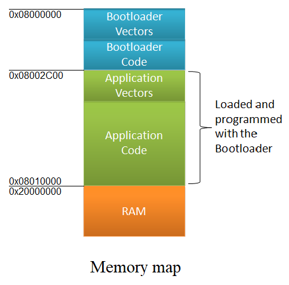

# USB Mass Storage Bootloader
This is USB Mass Storage Bootloader for Blue Pill STM32 boards (STM32F103C8/B MCU) 
You can simple use it for your project. ***Please star my repository if you want to use this source code.*** 
## Memory Map
When you supply power to your board - MCU runs the code placed at the beginning of flash memory, in stm32 it is 0x08000000. But this MCU is also able to run the program from another source, you need to specify where the program starts and where the table of interrupt vectors of the program is. The bootloader allows you to download this program via USB as if it were a normal flash drive and run it. It also makes it easy to check the integrity of the program by checking the checksum. 
  This project created in IAR ARM 8.1.13 and based on STM32 MSC demo and Emfat library.  

  
## How to use it
Download the binary for your MCU from the Output folder using J-Link or ST-Link at 0x08000000 address.
> Example for J-Link 
> erase 
> loadbin 0x08000000 YOUR_PROJECT_LOCATION/Output/stm32f103c8.bin 

Build your application and rename output application.bin to fw.bin 
Connect your device via USB. It will be displayed as a flash stick named BOOT. Open it, delete fw.bin and copy your fw.bin there.
